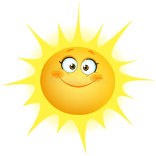

<h1 align="center">
    
    UVibes
</h1>

### Accédez facilement aux données UV pour n’importe quelle localisation et protégez-vous efficacement du soleil.

UVibes est un site web non lucratif qui fournit des données UV via l’API open-source [OpenUV](https://www.openuv.io/).  
Vous pouvez consulter les informations UV par coordonnées GPS ou par ville, et créer un compte pour enregistrer vos localisations favorites afin d’y accéder facilement sans ressaisir les coordonnées.

---

## Aperçu du site

Ci-dessous, un aperçu du fonctionnement de UVibes : saisie d’une ville et consultation des résultats UV.

---

## Fonctionnalités

- Consultation du taux UV par coordonnées (latitude, longitude, altitude facultative) ou par ville
- Création d’un compte utilisateur avec authentification Google ou par email/mot de passe pour sauvegarder ses localisations favorites
- Récupération de mot de passe pour les comptes existants
- Support multilingue (anglais / français)
- Guides pédagogiques sur l’exposition UV
- Formulaire de contact

Le projet utilise également plusieurs APIs secondaires pour améliorer l’expérience utilisateur, comme un autocomplete pour les villes et la récupération de l’heure locale.

---

## Technologies

- **Next.js / React / TypeScript** pour le développement (front-end et API handlers)
- **Tailwind CSS** pour le style
- **next-intl** pour le support multilingue (anglais / français)
- **API OpenUV** pour les données UV
- **OAuth via Google** pour l’authentification utilisateur

---

## Voir le projet

Vous pouvez accéder à UVibes en ligne ici : [UVibes](https://u-vibes.vercel.app/)